<p align="center">
  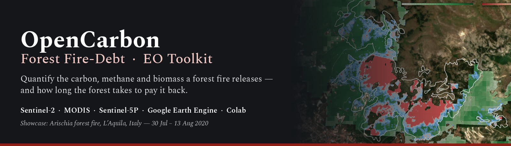
</p>

<p align="center">
  <a href="https://colab.research.google.com/github/2248220hub/OpenCarbon-Forest-FireDebt-EO-Toolkit/blob/main/notebooks/OpenCarbon_FireDebt_Toolkit.ipynb"></a>
  
  
  
  
</p>

<p align="center">
  <b>An open Earth-observation toolkit that turns free satellite data into a forest fire's carbon, methane and biomass budget —<br>
  and a forecast of how long the forest needs to pay it back.</b>
</p>

<p align="center">
  <a href="#-quick-start">Quick start</a> ·
  <a href="#-what-the-toolkit-does">What it does</a> ·
  <a href="#-run-it-on-your-forest">Your forest</a> ·
  <a href="#-showcase--arischia-italy-2020">Showcase</a> ·
  <a href="#-methods-worth-a-closer-look">Methods</a> ·
  <a href="#-roadmap">Roadmap</a> ·
  <a href="#-credits">Credits</a>
</p>

---

## ✦ An open toolkit for fire-emission accounting from space

**OpenCarbon · Forest Fire-Debt V1** is a free, open-source toolkit that turns public satellite data into the full carbon account of a forest fire: what burned, what it emitted, whether a satellite could see the methane, and how long the forest needs to recover. It runs as **one Google Colab notebook on Google Earth Engine** — no installation, no downloads, no paid data. Edit one configuration cell and it analyses another Mediterranean forest fire.

### What you can do with it

| Feature | What it gives you | Domain |
|---|---|---|
| **Fuel mapping** | burnable forest by type — CORINE ∩ ESA WorldCover, no tuned parameters | land cover |
| **Burn severity** | burned area and four severity classes from Sentinel-2 dNBR / RBR | optical |
| **Fire energy** | fire radiative power and energy from MODIS, and the fire's diurnal duty cycle | thermal |
| **Carbon Cycle Emission budget** | biomass, CO₂, CO, CH₄ and PM₂.₅ per fuel class, with 200,000-draw Monte-Carlo uncertainty | carbon accounting |
| **Methane detectability** | a pre-registered prediction of the plume signal, tested against Sentinel-5P, plus the detection floor for any plume geometry | atmospheric chemistry |
| **Recovery forecast** | eleven summers of canopy recovery per severity class against an unburnt control, projected forward | prediction |
| **Methane debt** | how many years of soil methane uptake the fire cancelled out | carbon cycle |
| **Share-ready outputs** | 7-layer HTML map, recovery dashboard, CSV results register, 300 dpi figures | communication |

Every number is written to one results register the moment it is computed. Anything modelled rather than measured is tagged `[MODELLED]`, so every figure you publish traces back to its source.

### Built for

| Who | What it gives them |
|---|---|
| 🛰️ **Earth-observation community** | a transparent, citable pipeline that combines optical, thermal and atmospheric sensors in one place, ready to extend with new sensors, sites or methods |
| 🎓 **Students & researchers** | a guided notebook where every block explains the physics, the formula and what to change, with a worked example saved inside to check your own run against |
| 📰 **Journalists** | defensible numbers for a fire story — hectares burned, tonnes of CO₂ and methane, recovery years — and a map readers can explore |
| 🏛️ **Governments & conservation organisations** | severity, fuel and recovery maps with a carbon and methane account per fire: evidence for national restoration plans under the **EU Nature Restoration Law**, LULUCF carbon reporting, the **EU Forest Strategy for 2030**, and forest-monitoring work such as the proposed **EU Forest Monitoring Law** |

### The showcase: why methane

The worked example is the 2020 fire at **Arischia** (L'Aquila, Italy). Methane was only **0.25 % of the mass** the fire emitted, yet it carries about **18 % of the fire's 20-year warming**: over that period each kilogram traps roughly eighty times more heat than CO₂. The same fire also shut down the soil bacteria that pull methane back out of the air. The **65 t** it released equals **47–140 years** of that forest's own methane uptake. Measuring that debt is what this toolkit was built for. → [Full showcase](#-showcase--arischia-italy-2020)

---

## ⚡ Quick start

1. **Get Earth Engine access** (free for research, education and non-profit use) and note your Cloud **project ID** → [setup guide](docs/01_SETUP.md)
2. **Open the notebook** →  <a href="https://colab.research.google.com/github/2248220hub/OpenCarbon-Forest-FireDebt-EO-Toolkit/blob/main/notebooks/OpenCarbon_FireDebt_Toolkit.ipynb"></a>
3. **Paste your project ID** into `GEE_PROJECT` in Block 0
4. **Runtime → Run all** — about 10–20 minutes. Results land in your Google Drive.

The first run reproduces the Arischia showcase so you can check your setup against known numbers. Then [point it at your own fire](docs/02_ADAPT_YOUR_FOREST.md).

---

## ✦ What the toolkit does

### Three sensors, three physical domains

<table>
<tr>
<td width="33%" align="center"><a href="assets/sensors/sentinel2_msi.png">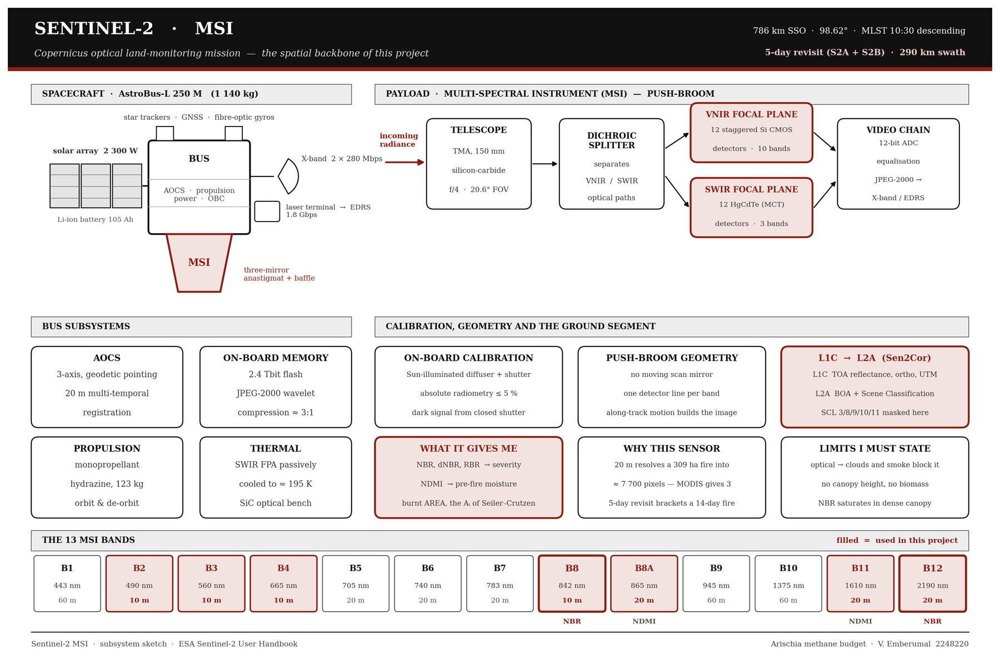</a></td>
<td width="33%" align="center"><a href="assets/sensors/modis_terra_aqua.png">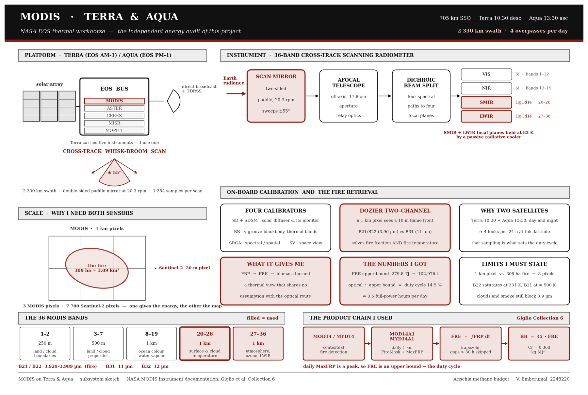</a></td>
<td width="33%" align="center"><a href="assets/sensors/sentinel5p_tropomi.png">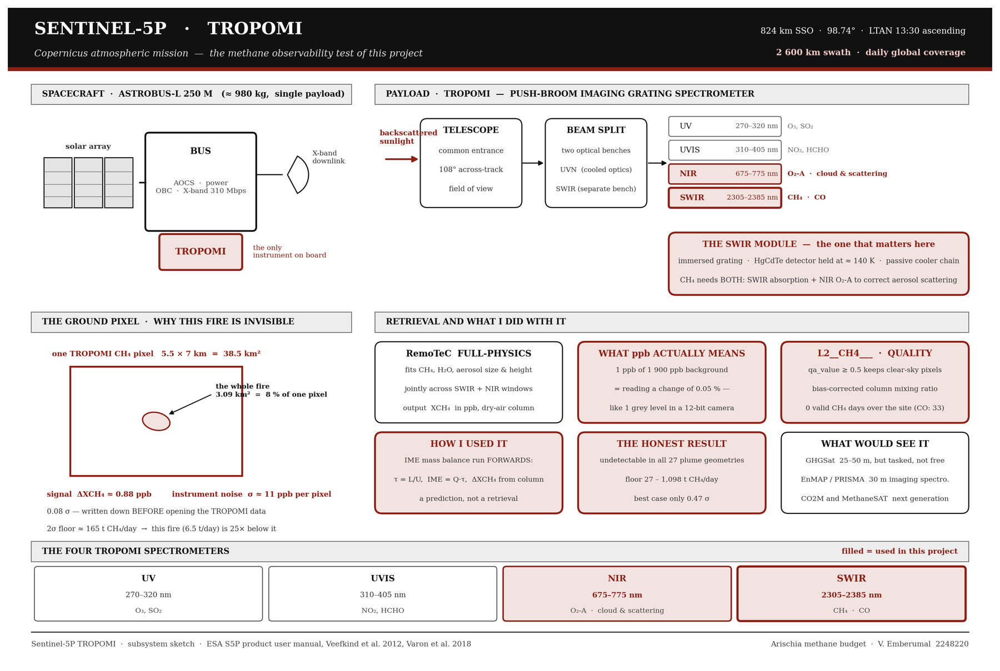</a></td>
</tr>
<tr>
<td align="center"><b>Sentinel-2 MSI · optical</b><br><sub>reflected sunlight, 10–20 m<br>→ burned area, severity, recovery</sub></td>
<td align="center"><b>MODIS Terra + Aqua · thermal</b><br><sub>emitted heat, 1 km, 4 looks a day<br>→ fire energy, diurnal duty cycle</sub></td>
<td align="center"><b>Sentinel-5P TROPOMI · chemistry</b><br><sub>molecular absorption, 5.5 × 7 km<br>→ methane column, detectability</sub></td>
</tr>
</table>
<p align="center"><sub>Click any sketch for the full subsystem diagram. Maroon = the instrument parts this toolkit uses.</sub></p>

### The pipeline

<p align="center">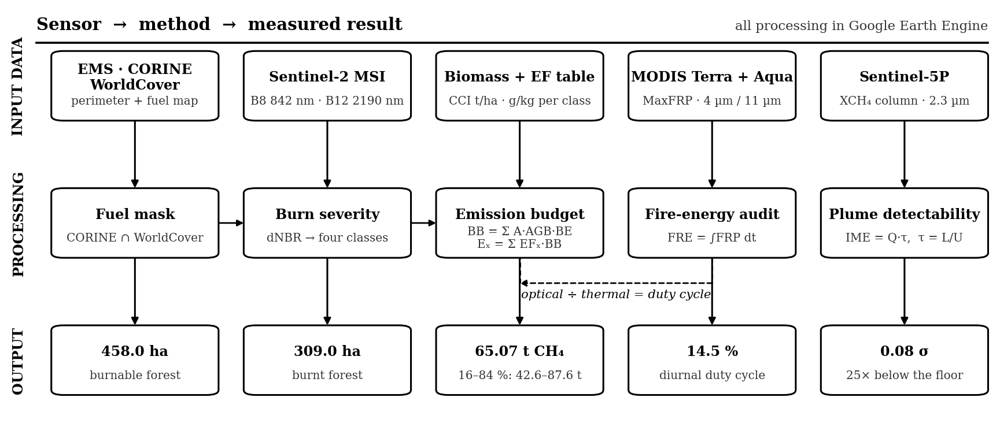</p>

| Block | Question | Data | Output |
|:--:|---|---|---|
| **0** | Setup | — | one configuration cell, results register |
| **1** | What *could* burn? | CORINE 2018 ∩ ESA WorldCover 2020 · Copernicus EMS | fuel map, ha per forest class, slope |
| **2** | What state was it in? | ESA CCI Biomass · Sentinel-2 NDMI · ERA5-Land | standing biomass, dryness anomaly, weather |
| **3** | What burned, how badly? | Sentinel-2 L2A | dNBR, RBR, four severity classes |
| **4** | How much energy? | MODIS MOD14A1 / MYD14A1 | FRP, FRE upper bound |
| **5A** | How much gas? | emission-factor table + Monte Carlo | CO₂, CO, CH₄, PM₂.₅ with uncertainty, methane debt |
| **5B** | Does severity matter? | interactive β sliders | severity-weighted budget |
| **6A** | Could a satellite see the methane? | Sentinel-5P TROPOMI | pre-registered prediction, then the test |
| **6B** | For any plume shape? | forward IME model | detection floor over 27 geometries |
| **7A** | Is the forest coming back? | Sentinel-2, 11 summers + unburnt control | NBR trajectory per severity class |
| **7B** | When will it finish? | exponential recovery model | canopy-recovery years, modelled methane-sink window |
| **8** | Share it | folium · matplotlib | 7-layer HTML dashboard, CSV register, summary figure |

### What you get

| Output | Format | Use it for |
|---|---|---|
| Results register — every computed number with block and unit | CSV | tables, fact-checking, citation |
| Fuel, severity, β-by-severity, recovery and plume-sweep tables | CSV | your own statistics |
| Pre-registered methane prediction, time-stamped | TXT | reproducibility |
| Seven-layer interactive map with findings panel | HTML | sharing with non-specialists |
| Recovery dashboard with trajectory, rates and forecast | HTML | reports, stories |
| Figures (severity, CH₄ by fuel class, recovery, detection floor) | PNG, 300 dpi | slides, papers |

---

## 🌍 Run it on your forest

Everything site-specific lives in **Block 0**. The rest of the notebook reads from it.

| Parameter | Meaning | Arischia default |
|---|---|---|
| `AOI_BBOX` | study box `[W, S, E, N]` | `[13.24, 42.34, 13.44, 42.50]` |
| `CTRL_BBOX` | unburnt control forest, same type | `[13.55, 42.34, 13.75, 42.50]` |
| `PRE`, `POST` | clearest Sentinel-2 dates before / after | `2020-07-29`, `2020-08-13` |
| `FIRE_START`, `FIRE_END` | burning period (end exclusive) | `2020-07-30`, `2020-08-14` |
| `EMS_ACTIVATION`, `EMS_ZIP`, `EMS_LAYER` | Copernicus EMS perimeter — or leave empty | `EMSR449` … `observedEventA` |
| `AGB_YEAR` | ESA CCI biomass year before the fire | `2019` |
| `BURN_MIN`, `SEV_BREAKS` | burned threshold and severity edges (dNBR) | `0.16` · `0.27 / 0.44 / 0.66` |
| `LAST_YEAR` | last summer in the recovery series | `2026` |

For fuel types other than temperate/Mediterranean forest, add CORINE classes in Block 1 and matching emission-factor rows in Block 5A. The full walkthrough — choosing a control forest, finding the EMS file, calibrating the burn threshold, sanity checks — is in **[docs/02_ADAPT_YOUR_FOREST.md](docs/02_ADAPT_YOUR_FOREST.md)**.

---

## 🔥 Showcase · Arischia, Italy, 2020

The worked example is the fire of **30 July – 13 August 2020** above Arischia (L'Aquila, central Apennines) — Copernicus EMS activation **EMSR449**, compared against the independent analysis of Laneve & Pampanoni (2021).

<p align="center">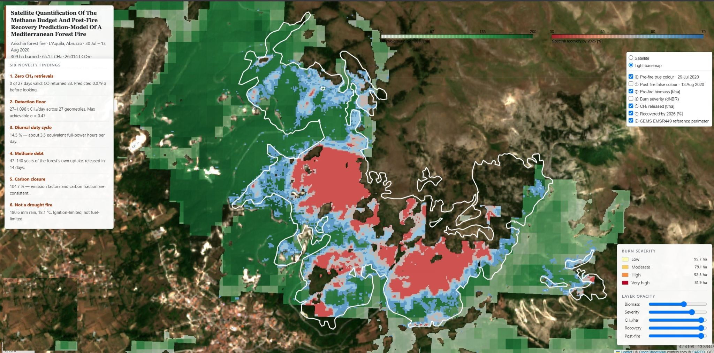<br>
<sub>Block 8B dashboard — severity, CH₄ per hectare, biomass and recovery layers over Sentinel-2, with the EMS perimeter in white.
  
| File | What it is | Preview |
|---|---|---|
| `dashboard.html` | minimal dashboard — headline numbers and the recovery curve only, for a quick look or embedding |[project page](https://2248220hub.github.io/OpenCarbon-Forest-FireDebt-EO-Toolkit/dashboard/dashboard.html) |
| `Final_dashboard.html` | full dashboard — recovery trajectory, year-on-year rates and the canopy / methane-sink forecast, all views in one page |[project page](https://2248220hub.github.io/OpenCarbon-Forest-FireDebt-EO-Toolkit/dashboard/Final_dashboard.html) |
| `recovery_dashboard.html` | Arischia recovery trajectory and methane-sink forecast on their own — fully self-contained |[project page](https://2248220hub.github.io/OpenCarbon-Forest-FireDebt-EO-Toolkit/dashboard/recovery_dashboard.html) |

### Headline numbers

| **638.99 ha** <br><sub>EMS perimeter</sub> | **458.0 ha** <br><sub>real fuel (28.3 % removed)</sub> | **309.0 ha** <br><sub>forest burned</sub> | **14,982 t** <br><sub>biomass consumed</sub> |
|:--:|:--:|:--:|:--:|
| **24,244 t** <br><sub>CO₂</sub> | **65.07 t** <br><sub>CH₄ · 42.6–87.6 t</sub> | **104.6 %** <br><sub>carbon mass balance</sub> | **+9.2 %** <br><sub>vs published CH₄</sub> |
| **14.5 %** <br><sub>diurnal duty cycle ≈ 3.5 h/day</sub> | **0.08 σ** <br><sub>methane signal vs TROPOMI noise</sub> | **47–140 yr** <br><sub>methane debt</sub> | **36–67 %** <br><sub>canopy recovered by 2026</sub> |

### Why methane matters here

<p align="center">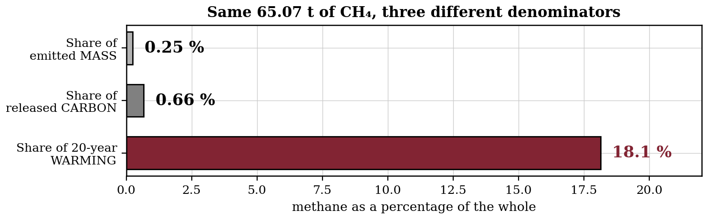</p>

The same 65 tonnes are **0.25 % of the mass**, **0.66 % of the carbon** — and **about 18 % of the fire's 20-year warming**. And because temperate forest soils oxidise 1.5–4.5 kg CH₄ ha⁻¹ yr⁻¹, the fire released **47–140 years** of this forest's own methane uptake in two weeks.

<table>
<tr>
<td width="50%">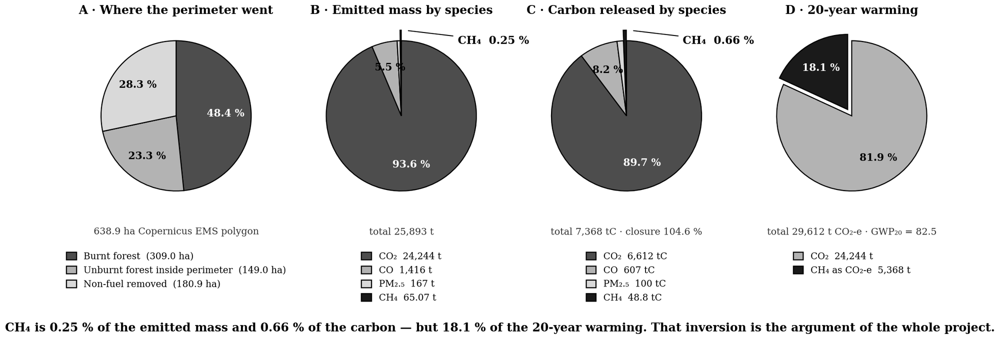</td>
<td width="50%">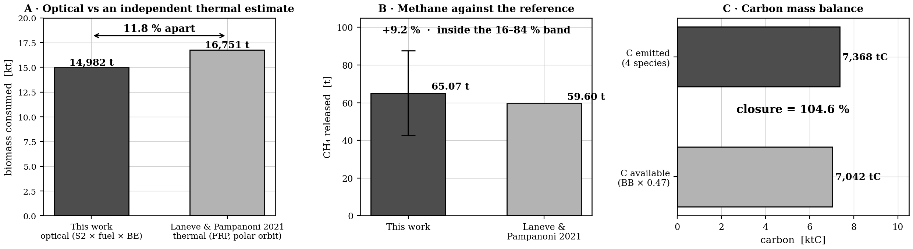</td>
</tr>
<tr>
<td align="center"><sub><b>Where the carbon went</b> — perimeter, emitted mass, carbon and 20-year warming</sub></td>
<td align="center"><sub><b>Consistency</b> — optical biomass vs the reference thermal estimate (11.8 %), CH₄ vs the reference, carbon closure</sub></td>
</tr>
<tr>
<td>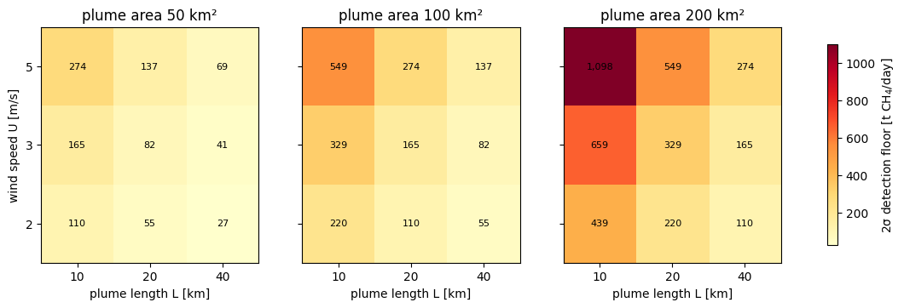</td>
<td>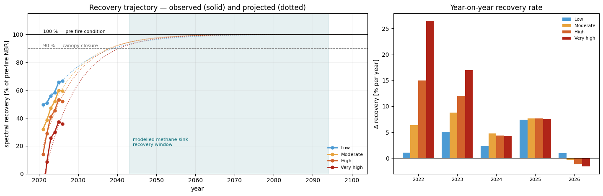</td>
</tr>
<tr>
<td align="center"><sub><b>Invisible to methane satellites</b> — the fire emitted 6.5 t CH₄/day; the 2σ floor is 27–1,098 t/day across 27 plume geometries</sub></td>
<td align="center"><sub><b>Recovery</b> — observed (solid) and projected (dotted) spectral recovery, with the modelled methane-sink window</sub></td>
</tr>
</table>

### Recovery forecast

| Severity | Burned | Recovered by 2026 | k [yr] | 90 % canopy | Full canopy | CH₄ sink *(modelled)* |
|---|--:|--:|--:|--:|--:|--:|
| Low | 95.7 ha | 66.7 % | 10.9 | 2039 | 2057 | 2045 – 2094 |
| Moderate | 79.1 ha | 59.4 % | 8.9 | 2038 | 2053 | 2043 – 2085 |
| High | 52.3 ha | 51.9 % | 8.3 | 2038 | 2052 | 2044 – 2083 |
| Very high | 81.9 ha | 35.8 % | 8.3 | 2041 | 2055 | 2047 – 2089 |

Severity sets how deep the hole is, not how fast the forest climbs out. Canopy years are projected from eleven observed summers; the methane-sink window is **modelled** — soil methanotrophs are invisible to every satellite band.

Full write-up → **[technical note](docs/paper/Arischia_Technical_Note.md)** ([PDF](docs/paper/Arischia_Technical_Note.pdf)) · exam presentation → **[PDF](docs/presentation/Arischia_Exam_Presentation_Sep2026.pdf)** · every number → **[results register](results/arischia_results_register.csv)**

---

## 🧪 Methods worth a closer look

<table>
<tr>
<td width="50%">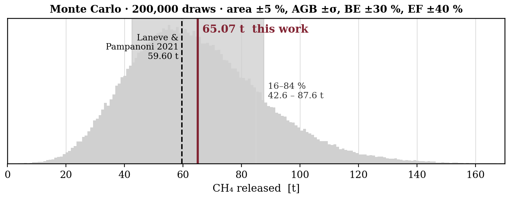</td>
<td width="50%">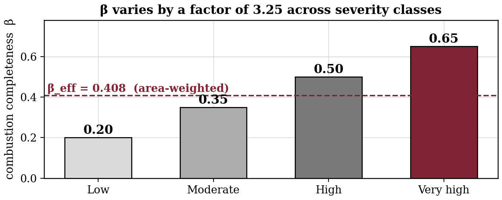</td>
</tr>
</table>

- **Monte-Carlo uncertainty** — 200,000 draws over area (±5 %), biomass (± class σ), burn efficiency (±30 %) and emission factor (±40 %). Because the terms multiply, the result is right-skewed; the 16–84 % band (42.6–87.6 t) is reported instead of a symmetric ±. The emission factor dominates — better imagery would not narrow the estimate, field data would.
- **Combustion completeness by severity** — β = 0.20 / 0.35 / 0.50 / 0.65, mean-preserving, explored with live sliders. Methane moves by only −3 %: the budget is robust to how burning is distributed.
- **Two-source fuel mask** — CORINE fuel *type* ∩ WorldCover fuel *extent*, no tuned parameter.
- **Pre-registration** — the methane prediction is time-stamped to a file *before* Sentinel-5P data are opened.
- **Control forest** — an unburnt stand run through every temporal step; recovery is only trusted if the control stays flat (drift −1.4 %, σ 0.0108 NBR).
- **Measured vs modelled** — anything inferred rather than observed is tagged `[MODELLED]` in the register.

Formulas and constants: **[docs/03_METHODS.md](docs/03_METHODS.md)** · data provenance: **[docs/04_DATA_SOURCES.md](docs/04_DATA_SOURCES.md)**

---
## 🌱 Beyond the canopy · microbes and megaherbivores

Satellites measure the canopy. The two cycles that decide whether a burned Mediterranean forest becomes a methane sink again run where no satellite band reaches: in the soil, and in the animals that shape the fuel.

### The microbial cycle — the methane sink

- **Who does the work.** Methanotrophic bacteria in the organic horizon of well-drained forest soils oxidise atmospheric methane, 1.5–4.5 kg CH₄ ha⁻¹ yr⁻¹ in temperate forests — the main biological methane sink on land.
- **What a fire does to them.** It burns the organic horizon they live in. The ash releases ammonium, which competes with methane for the bacteria's key enzyme, methane monooxygenase. Lost soil structure, and compaction from post-fire machinery, then slow methane's diffusion into the soil.
- **Why recovery lags the canopy.** Leaves can return within two decades; a working organic horizon and its microbial community take longer. The toolkit applies a 1.3–2.0× lag to the canopy timeline and labels the result **modelled**. At Arischia that gives 2043–2094 for the sink, against 2038–2041 for 90 % canopy.
- **What would close the gap.** Soil flux chambers or eddy-covariance towers along a severity gradient. Management matters too: avoid ammonium-based fertiliser on burned soils, and protect the litter layer during salvage logging.

### The megaherbivore cycle — the fuel and the soil

- **Fuel.** Large herbivores — deer, free-roaming cattle and horses, managed goats and sheep — thin the understorey and break the continuity of fine fuel that carries a surface fire into the crowns. Less continuity means lower severity, and severity drives the combustion completeness β that dominates the emission budget.
- **Soil.** Dung and trampling speed up nutrient turnover and mix litter into the soil, which feeds microbial recovery. At high densities the same animals compact the soil and reduce gas diffusivity. The outcome depends on stocking density.
- **In practice.** Targeted grazing is already used for fire prevention in Mediterranean Europe. Catalonia's *Ramats de Foc* programme, for example, pays shepherds to graze strategic firebreaks.
- **What EO can and cannot see.** Satellites can map the outcome — lower severity and faster canopy recovery in grazed stands — but not the animals or the soil. Pairing grazing records with this toolkit's severity and recovery layers is a testable next study.

> Canopy recovery is **measured**. Methane-sink recovery is **modelled**. The gap between those two timelines is where soil ecology and landscape management settle the forest's methane debt, and where Earth observation needs ground partners.

---

## 🗺️ Future Research Roadmap - Inviting Contributions 🙌

| Next step | Why |
|---|---|
| **Hyperspectral image processing** — EnMAP and PRISMA now, Copernicus CHIME next | fuel mapped by species and moisture instead of four CORINE classes · burn severity from spectral unmixing of char, ash and green vegetation · methane plumes retrieved with a matched filter in the 2.3 µm band, at 30 m instead of 5.5 × 7 km |
| **GEDI lidar** canopy height by severity class | recovery of *structure*, not only spectral colour |
| **Data fusion** — Sentinel-1 + Sentinel-2 + GEDI | one recovery model across optical, radar and lidar |
| **ESA SNAP** Sentinel-1 SLC interferometric **coherence** | a structural-change signal independent of radiometric calibration |
| **Gaussian-process** recovery prediction | recovery years with credible intervals |
| **VIIRS 375 m** fire radiative power | seven times more fire pixels than MODIS for small fires |
| Targeted methane sensors — **GHGSat, CO2M** | point-source and next-generation sensors that could see plumes below TROPOMI's floor |
| **Soil and grazing ground truth** | flux-chamber and grazing records to turn the modelled methane-sink window into a measured one |
| **Multi-site** runs on larger Mediterranean fires | map where the methane detection floor is crossed |

Contributions and fire case studies are welcome — see [CONTRIBUTING.md](CONTRIBUTING.md).

---

## 📁 Repository layout

```
OpenCarbon-Forest-FireDebt-EO-Toolkit/
├── notebooks/   OpenCarbon_FireDebt_Toolkit.ipynb   ← the toolkit (Colab + Earth Engine)
├── docs/        setup · adapt-your-forest · methods · data sources
│   ├── paper/          technical note (Markdown + PDF)
│   ├── presentation/   exam presentation, Sapienza, Sep 2026
│   └── reference/      sensor sketches, missions & data levels, SNAP operators, SAR polarisation
├── results/     Arischia results register and per-block tables (CSV)
├── dashboard/   self-contained recovery dashboard (HTML)
├── assets/      banner, sensor sketches, result figures
└── CITATION.cff · LICENSE · requirements.txt · environment.yml
```

---

## 👤 Author

**Vinoth Emberumal** — MSc Space & Astronautical Engineering, Sapienza University of Rome.
Built end to end: problem framing, the Earth Engine pipeline, uncertainty analysis, recovery modelling, dashboards and documentation.

`Google Earth Engine` `Python` `optical · thermal · atmospheric remote sensing` `Monte-Carlo uncertainty` `time-series modelling` `GeoPandas · folium` `scientific communication`

## 🙏 Credits

Developed for the *Earth Observation* course of **Prof. Ferdinando Nunziata**, **Sapienza University of Rome**. Emission factors and the independent reference budget: **G. Laneve & V. Pampanoni (2021)**, *Review of satellite based support to forest fire environmental impact assessment: the example of Arischia (Italy) forest fire*, Geografia, Riscos e Protecção Civil 2, 163–178 — [doi:10.34037/978-989-9053-06-9_1.2_12](https://doi.org/10.34037/978-989-9053-06-9_1.2_12). Methods after Seiler & Crutzen (1980), Key & Benson (2006), Parks et al. (2014), Wooster et al. (2005), Varon et al. (2018) and Dutaur & Verchot (2007). Data: Copernicus Sentinel-2, Sentinel-5P, CORINE and EMS · ESA WorldCover and CCI Biomass · NASA MODIS · ECMWF ERA5-Land · Google Earth Engine.

## 📜 Cite & licence

```bibtex
@software{emberumal_2026_opencarbon,
  author = {Emberumal, Vinoth},
  title  = {OpenCarbon · Forest Fire-Debt EO Toolkit},
  year   = {2026},
  url    = {https://github.com/2248220hub/OpenCarbon-Forest-FireDebt-EO-Toolkit}
}
```

Code: **MIT**. Documents and figures: **CC BY 4.0**. Satellite data remain under their providers' terms.
